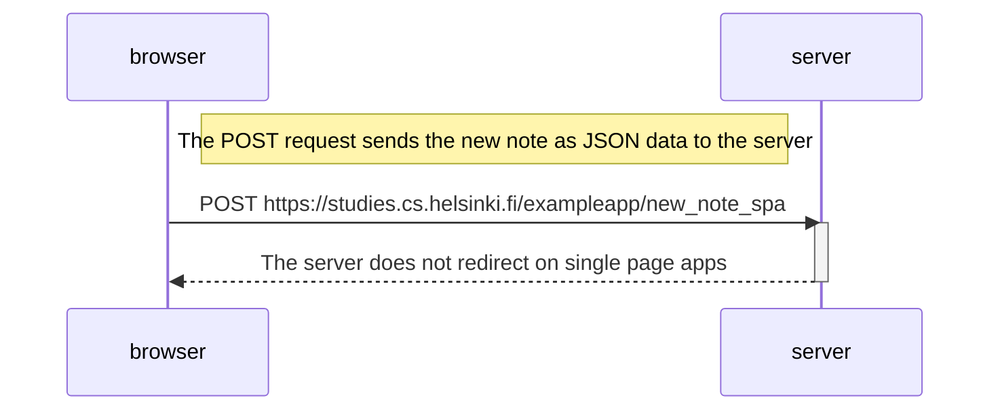

# Exercice 0.6

```mermaid

sequenceDiagram
    participant browser
    participant server

    Note right of browser: The POST request sends the new note as JSON data to the server

    browser->>server: POST https://studies.cs.helsinki.fi/exampleapp/new_note_spa
    activate server
    server-->>browser: The server does not redirect on single page apps
    deactivate server

```
